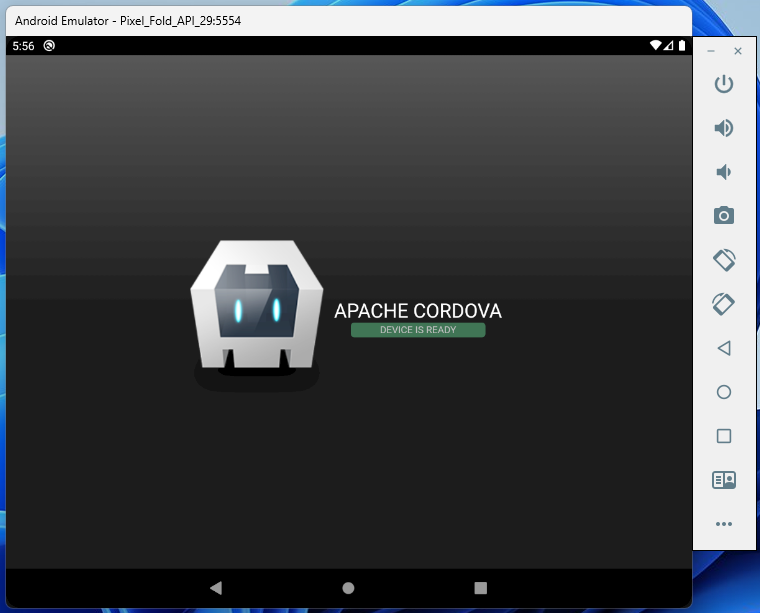

# ⚛️ Cordova Bootstrap

> Apache Cordova (PhoneGap) + WebServer to host your PWA locally



## Setup

**1. Install Android Studio and Gradle**

```bash
choco install android-sdk
choco install gradle
```

**2. Copy your website to www folder**

```bash
cp -R ./react-essential/build ./cordova-bootstrap/www
```

**3. Build for Android**

```bash
npm run build:android
```
